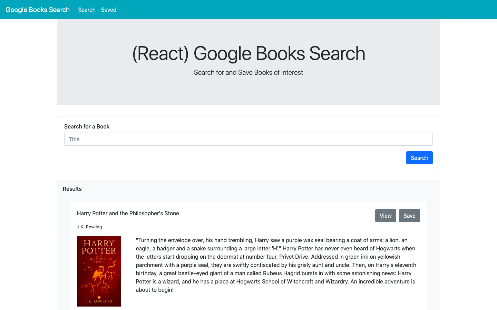
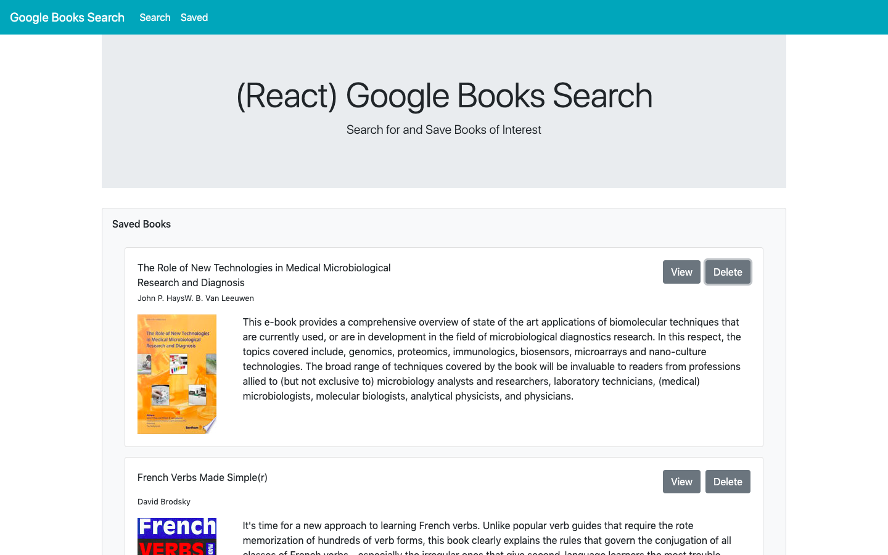

# **UNC Assignment #16 - Google Books Search**
> Created by Matthew Farmer

## About
'Google Books Search' is a MERN-stack application designed to allow users to search books from the Google Books API. 

## Walkthrough

### Search Books

The image below illustrates the 'Search' page. On this page, users will be presented with the ability to search for a book. Once the user submits a search term, the Google Books API will return the most relevant results. Users may save any result (to a persistent database) for future refernce or click 'View' to be taken to a preview of the book.

### Reference Saved Books

The image below illustrates the 'Saved Items' page. On this page, users will be presented with a list of any books that have been saved. Users have the ability to remove any saved book from their list of saved items as well as the ability to view a preview of the book by clicking 'View'.

## Additional Information

### Technologies Used

This application is built on NodeJS and is hosted on Heroku. It utilizes MongoDB for its database, Mongoose as its ORM, Express for routing, and React for its front end. React Router is used for controlling which components are visible to the user.
